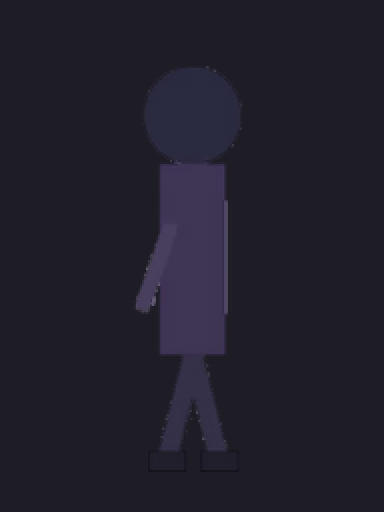
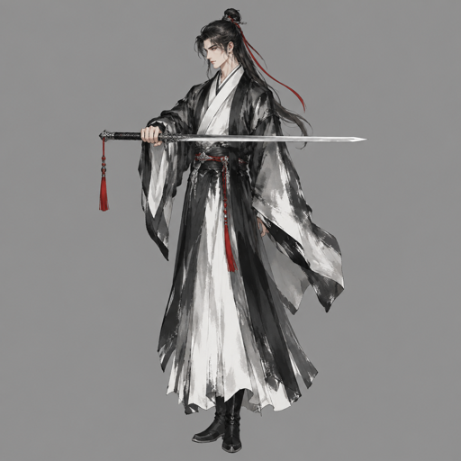
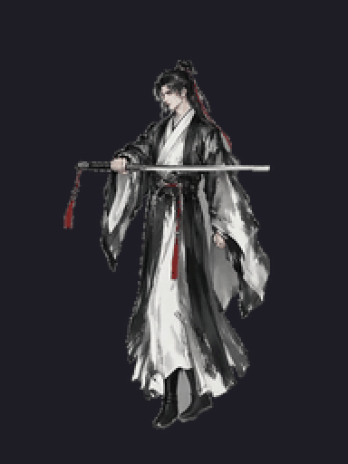
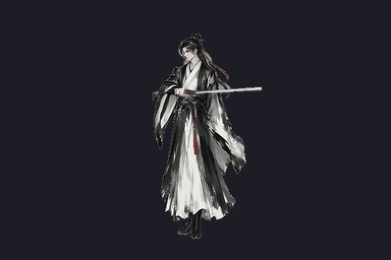
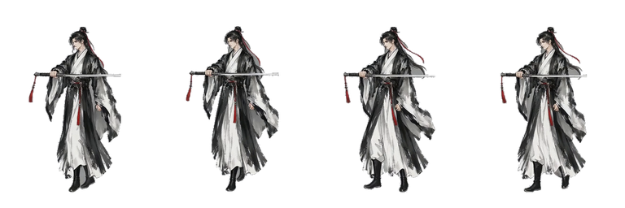
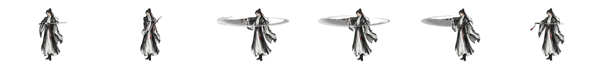

# anim-pipeline

**一个人用 AI 做 2D 角色动作动画**的完整管线：从一张立绘到游戏里能用的序列帧图集。

```
一张立绘  →  图生视频  →  抽帧  →  抠图  →  对齐  →  序列帧图集
```

<p align="center">
  
  &nbsp;&nbsp;&nbsp;&nbsp;
  
  <br>
  <sub>↑ <code>python tools/demo.py</code> 零成本跑出来的：左边是循环预览，右边是接进游戏的图集（4 列 × 192×256）</sub>
</p>

工具只是外壳，真正的东西是那份 **[AI角色动画管线.md](AI角色动画管线.md)** ——
它记了一个真实项目里**走死的五条路**、**每一笔花掉的钱**，和十条最贵的教训。
**先读它，再跑脚本。** 不读的话，这些脚本能帮你更快地烧钱。

产物是**普通的 PNG 序列帧图集**，不绑引擎。原项目验证于 Cocos Creator 3.8.8，
但 Unity / Godot / 网页 canvas 一样能用；只有管线文档 §6.1 那几个"接线零件"是引擎相关的。

---

## 真实实测：一句话 → 国风水墨剑客（2026-09-09）

<p align="center">
  
  &nbsp;
  
  &nbsp;
  
  <br>
  <sub>输入：「国风水墨画风格的剑客，身穿长衫，手持一柄长剑」→ gpt-image-2.5 立绘 ¥0.15 → 万相 480P/2s 走路 ¥0.40 → 万相 480P/2s 攻击 ¥0.40 ＝ <b>¥0.95</b>，全程约 6 分钟</sub>
</p>

<p align="center">
   &nbsp; 
</p>

| 动作 | 动量 | 形变 | 循环缝 | 剪影密度 | 亮度漂 | 位移 | 其它 |
|---|---|---|---|---|---|---|---|
| 走路（4 帧 loop） | 44.3 | 15.1% | **1.30** | 48.0% | 8.8 | −1.7% | 周期 35 帧 |
| 攻击（6 帧，DeepSeek 挑 12/21/30/33/36/50） | 74.1 | 39.0% | — | 49.5% | 5.8 | — | 无崩坏、无细线帧、图集自检通过 |

对照文档基准 Move（48.1 / 17.8% / 0.99）和 Die（69.9 / 40.2%）——同一量级。

这次实测顺手撞出并修掉的：智谱 CogVideoX-3 **首尾帧给同一张图会一动不动**；不给首尾帧则**推镜头 + 转正面**（文档 §3.2 原样重现）；
DeepSeek 扩写的走路运动段带了「长剑划出弧线」，万相就只演挥剑腿不动 ⇒ 走路规则加「武器保持原位」；
`vid2anim` 找不到循环段原来会**静默切出 4 张同帧**，现在退回均匀采样并大声提示；`_move_check` 从 371 秒降到秒级。

---

## 这套方法适合谁

**适合**
- 单人 / 小团队，**没有美术**
- 2D，角色朝向少（横版左右两向最理想）
- 角色风格统一、有一张能定稿的立绘

**边界**（只有一条是真的墙，其余是代价倍增或要绕一下）

| 需求 | 能不能 | 怎么做 | 代价 |
|---|---|---|---|
| 换皮肤（整套换，3~5 套） | **能** | 换立绘重跑所有动作。最好用中转站的参考图/编辑能力在**同一张立绘上改服装**，姿势比例不变 | 每套 × 每动作各一发（两动作约 ¥1.6/套） |
| 部件组合装备（头盔 × 铠甲 × 武器） | **不能** | 组合爆炸，只能分层纸娃娃——而"把厚涂图正确拆层"正是这条路当初绕开的 | — |
| 更多帧（12 / 24 帧） | **能试** | `--frames` 随便填，150 帧里挑。文档说 3~6 帧是**质量筛选后活下来的数**，不是参数限制：帧越多，相邻帧越像，模型逐帧抖动和刀形变异就越显眼 | 用 `anim_bench` 的亮度漂 / 形变判，跑一发就知道 |
| 格斗游戏 | 看规模 | 真正的瓶颈是**招式数 × 每招一发 × 返工**，不是每招帧数 | 线性堆钱 |
| 4 / 8 方向 | 4 可试，8 痛苦 | 左右靠镜像免费；前/后各出一张立绘再跑全套 | ×4；跨方向一致性靠模型 |
| 交互动作（抱、扛、投技） | **分开做** | 两个角色**同框**出片不行（对齐算法假设单人）。按 2D 游戏惯例拆成"攻方投掷 + 受方被摔"两条单人动画，靠时间轴对齐 | 两条动画的钱 |

---

## 装

```bash
pip install -r requirements.txt      # numpy + Pillow，就这两个
```

外部还需要 **ffmpeg** 在 PATH 里（抽帧用）。三家视频/图像 API 的调用是标准库 urllib 手写的，
没有任何厂商 SDK。

### 配 key

```bash
python tools/_creds.py               # 先看缺哪家、缺了会怎样
python tools/_creds.py --set=wan     # 交互式填一家，写进 ~/.gamegen/creds.json（不进仓库）
```

查找顺序：**环境变量 → `~/.gamegen/creds.json` → 当前目录的 `.env` / `config.json`**。

四家不是"配哪个用哪个"，**每一步有它必须用的那家**：

| | 干什么 | 为什么不能换别家 |
|---|---|---|
| `relay` 中转站 gpt-image | 出立绘 | 只有它能喂参考图定画风 + 出透明底 |
| `wan` 阿里万相 | **出片定稿** | 只有它能钉首尾帧（`--last`），且不重画角色 |
| `ark` 火山 seedance | 抽结构 | 免费额度，但它做大动作是在**重新生成角色** ⇒ 只能抽不能定稿 |
| `glm` 智谱 | 免费抽构图 | 省万相额度；做不出大动作 |

`_creds.py` 会在**花钱之前**把这件事告诉你。

---

## 五分钟跑通（不花钱、不注册）

```bash
git clone https://github.com/lihongfu-ts/anim-pipeline
cd anim-pipeline
pip install -r requirements.txt

python tools/doctor.py     # ① 环境 / 凭据 / 路径一次问完，缺什么、怎么补
python tools/demo.py       # ② 零成本跑通「视频 → 序列帧图集」这后半段
```

`demo.py` 自己合成一段走路视频，然后走**和真实素材完全相同的那份代码**：
抽帧 → 抠灰底 → 按脚底/头部重心对齐 → 按核心面积归一 → 切图集 → 验收打分。
跑完去看 `out/anim/demo_walk.png`（图集）和 `work/anim/demo_walk_看.gif`（预览）——就是上面那两张。

它**不能**替你回答"AI 出的片好不好"。那是前半段（立绘 → 提示词 → 出片）的事，那一段必须花钱、
也最需要判断力。demo 只证明你的环境是通的，并让你先看清产物长什么样。

### 然后：用你自己的立绘

路径约定：**数据根 = 当前工作目录**。`cd` 到你的项目再跑，产物就落在那儿：

```
<你的项目>/work/anim/    中间产物：视频、联络表、预览 gif、任务 id 日志
<你的项目>/out/anim/     成品：序列帧图集
```

（要挪位置就设 `ANIMPIPE_WORK` / `ANIMPIPE_OUT`。）

```bash
cd /path/to/your-project
T=/path/to/anim-pipeline/tools            # 下面用 $T 代替（Windows cmd 用 set T=… 和 %T%）

python $T/_creds.py --set=wan             # 只有万相能钉首尾帧 —— 这是唯一必配的一家

python $T/make_liubai.py 立绘.png 留白.png                      # ① 立绘 → 留白图（§1.3）
python $T/gen_video.py --img=留白.png --last=留白.png --tag=walk \
       --promptfile=p_walk.txt --provider=dashscope --res=480P --dur=2   # ② 出片（唯一花钱的一步）
python $T/_contact.py work/anim/walk.mp4                        # ③ 看带帧号的联络表，再挑帧
python $T/vid2anim.py work/anim/walk.mp4 --tag=walk --frames=4 --pick=loop   # ④ 切图集
python $T/anim_bench.py --sheet=out/anim/walk.png --cell=192x256             # ⑤ 验收
```

只有第 ② 步花钱（万相 480P / 2s ≈ ¥0.4）。其余全部免费，可以随便跑。
`--img` 和 `--last` 给同一张图，首尾帧就一模一样 —— 这是所有动作能互相衔接的地基（§3.4）。

---

## 网页端：一句话 → 角色 + 移动 + 攻击

```bash
pip install -r web/requirements.txt      # fastapi / uvicorn / python-multipart
python web/server.py                     # → http://127.0.0.1:8765
```

<p align="center"><sub>生成 · 预览 · 提取 · 凭据 —— 四个页签</sub></p>

- **生成**：一句话描述角色 → 出立绘 → 留白图 → 每个动作出片 → 图集 → 验收。动作可勾选、可加自定义、
  有「拳击三连招」预设（刺拳 → 平勾 → 上勾，三种剪影分得开，是文档 §7 那套教训的直接应用）。
  **每个动画独立记账**：预估 / 实花分开显示，视频按「任务 id 落盘时刻」记——片取不回钱照扣。
  `demo` 模式用合成素材走完全相同的后半段代码，不花钱，用来测链路。
- **图生图**：基于已有立绘改一版（换武器 / 换装），姿势比例不变。换了立绘走路也要重跑（唯一源图原则）。
- **预览**：Canvas 逐帧播图集，可调 fps、**逐帧 holds（顿帧）**、洋葱皮看循环缝、像素放大；旁边是五项验收指标、
  位移量化、图集自检结论、这个动画花了多少钱。
- **提取**：下载图集 / GIF / ZIP（图集 + 逐帧 PNG + `manifest.json`：格子、帧数、footTrim、holds、命中帧、取消窗口、连招顺序）。
  也能上传任意图集预览和切帧。
- **凭据**：网页端配 key（写 `~/.gamegen/creds.json`，不回显完整 key），每家一个「检查」：认证通不通、能列模型的列出来、
  报错带正文。提示词扩写用的大模型（`llm`）单独配，任意 OpenAI 兼容端点。

服务只监听 127.0.0.1。管线代码一行不动——每一步都是 subprocess 调 `tools/` 里那份脚本，每个任务一个独立目录。

---

## 给 agent 用：三种接法，同一份工具

| 形态 | 谁当脑子 | 怎么接 | 适合谁 |
|---|---|---|---|
| **DeepSeek Harness 插件** `dsh-plugin/` | dsh 里的 V4 Pro（多模态，自己看联络表） | `dsh plugin --profile web add ./anim-pipeline/dsh-plugin` + `npx skills add https://github.com/lihongfu-ts/anim-pipeline` | 大陆用户，一个 DeepSeek key |
| **MCP server** `mcp/server.py` | 任何支持 MCP 的 harness（Claude Code / Cline / Continue / dsh） | `pip install mcp` → `claude mcp add anim-pipeline -- python D:/anim-pipeline/mcp/server.py` | 已有 harness 的人 |
| **自带大脑的网页端** `web/` | `web/agent.py`（纯 JSON 协议，DeepSeek / GLM / 任意 OpenAI 兼容端点） | `python web/server.py` → Agent 页签 | 不想装 harness、要看过程和记账的人 |

三种形态背后是同一份 Python：`mcp/server.py` 既是 MCP server，也是 `python mcp/server.py call <工具> < 参数.json` 的 CLI（dsh 插件就是这么调它的）。
判断力在 [skills/anim-pipeline/SKILL.md](skills/anim-pipeline/SKILL.md)——提示词铁律、provider 分工、读数路由、花钱纪律——**工具给手，skill 给脑**。

### key 配在哪（一处配、三种形态通用）

`tools/_creds.py` 的查找顺序：**环境变量 → `~/.gamegen/creds.json` → 当前目录 `.env` / `config.json`**。

- 命令行：`python tools/_creds.py --set=wan`（交互式，写用户目录，不进仓库）；`python tools/_creds.py` 报告缺哪家、能做哪一步
- 网页端：「凭据」页签
- dsh 插件：插件设置里填，插件以 `DASHSCOPE_API_KEY` 等环境变量注给 Python（[dsh-plugin/README.md](dsh-plugin/README.md)）

只有万相是**必需**的（出片定稿唯一能钉首尾帧）；已有立绘就不需要中转站。
**拿万相 key**：<https://platform.qianwenai.com/try-ai?scene=video> → 「万相 3.0 - 视频生成」→ 右上角「获取 API Key」→ `sk-ws-` 开头的 key，
baseUrl 用公共域名 `https://dashscope.aliyuncs.com/api/v1`（实测可用；普通 `sk-` key 才需要业务空间专属域名）。

---

## 工具清单

| 工具 | 作用 |
|---|---|
| `doctor.py` | **先跑这个**：环境 / 凭据 / 路径一次问完，告诉你现在能做哪一步、缺什么怎么补 |
| `demo.py` | 零成本跑通后半段（自己合成素材，不调任何 API），看清产物长什么样 |
| `gen_video.py` | 图生视频，四个 provider（dashscope / zhipu / ark / minimax），支持 `--last` 首尾帧、`--poll` 断点续取 |
| `vid2anim.py` | **核心**：视频 → 序列帧图集。三种挑帧模式、对齐、归一化、冻结 |
| `anim_bench.py` | 判据。上下限从已出货的游戏量出来，不是拍脑袋 |
| `make_liubai.py` | 立绘 → 留白图（可指定 `--cx` 做位移尾帧） |
| `_contact.py` | 带**帧号**的联络表（别手搓 ffmpeg tile） |
| `_blade_check.py` | 逐帧查「刀有没有变成细白线」——指标查不出来的那一类 |
| `_anim_check.py` | 图集自检：朝向 / 招式间 IoU 区分度 / 贴图与 trim 配对 / 脚底一致 / 贴边 |
| `_move_check.py` | 逐帧量位移和抬升，换算成游戏像素 |
| `artgen/gen.py` | 出图 |
| `artgen/alpha.py` | 黑底抠图（自发光特效用） |
| `artgen/cutout_grey.py` | 中性灰底抠图（角色用，含去底色反解） |

> `provider` 决定端点 / 请求体 / 轮询格式三样，**别只换 model 名**。
> `artgen/` 三个脚本与 Claude Code skill `ai-asset-gen` 同源。

---

## 移植到你自己项目时，三条最容易栽的

**① 判据的基准素材不在这个仓库里，而且你多半得自己重量一份。**

`anim_bench.py` 的合格区间是从 `Slash-The-Hordes`（538★，已发布的 Cocos 割草游戏）
主角的 9 张 32×32 上量出来的。那份素材是别人的游戏资源，不跟着分发：

```bash
git clone https://github.com/AlexeyGorbunov/Slash-The-Hordes
set ANIMPIPE_REF=<那份>/assets/Media/Images/Game/Player
```

**换画风、换画幅、换头身比，这套阈值就不再成立** —— 照抄会把好片判废、把废片判过。
正确做法是从**你认可的某个已出货产品**上重量一份。方法见管线文档 §5.1。

**② 提示词不能抄，但结构必须抄。**

`gen_video.py` 里的 `PROMPT_EXAMPLE` 描述的是某个特定角色（红雾、厚涂、暗调），
直接拿去用只会出废片。要抄的是它的**四段结构**：镜头钉死 / 人物钉死 / 只放开该动的 / 画风锁死。
三条铁律和五条推论在管线文档 §2 —— 那是前 7 次生成换来的，也是这条链最贵的部分。

**③ 花钱的纪律得跟着一起搬。**

```
① 抽卡用免费的（ark 探姿势 / GLM 探静止型），方向定了再用万相出定稿
② 万相一次一发，不散弹
③ 任何消耗额度的生成，发之前先确认
④ 任务 id 立刻落盘 —— 已经因为 `| tail -6` + 中途杀进程丢过一次，片取不回、钱照扣
⑤ 提示词的历史版本和每一轮的病因都留着，那是防重犯的
```

`gen_video.py` 已经把 ④ 做进去了（提交成功立刻 append 到 `work/anim/_tasks.log`）。
它也**不会**在你忘了给提示词时偷偷用示例提示词兜底 —— 宁可在花钱前停下。

---

## 一条贯穿始终的线

> 这套管线的全部价值在于**把"理解画面内容"这件事外包给了模型**，自己只做机械操作。
> 裁切、抠图、缩放、对齐，全部不需要理解画面内容。
> 任何一步一旦需要你去理解并拆解画面，成本就会回到骨骼动画那个量级 ——
> 那正是这条路当初绕开的东西。

还有一条，是十条教训里最省钱的那条：

> **静默失败是最贵的。** 抠图失效、身高恒等于画面高、贴图与 trim 不配对、任务 id 丢失 ——
> 这四件事**一行报错都没有**。所以每一处都得有自检脚本，这也是这里为什么有这么多 `_*_check.py`。
